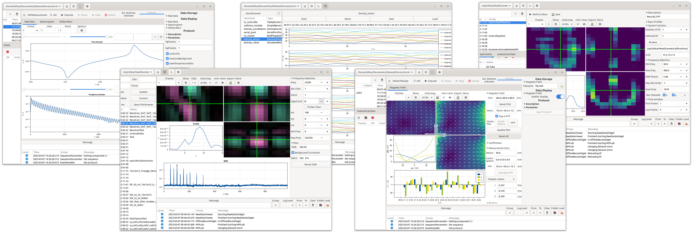

# MPIUI




[](https://github.com/tknopp/MPIUI.jl/actions?query=workflow%3ACI)


## MPI Packages Build Status

| **ImageUtils** | **RegularizedLeastSquares** | **SparsityOperators** | **MPIFiles** | **MPIReco** | **MPIMeasurements** |
|:----------------:|:----------------:| :----------------:|:----------------:|:----------------:|:----------------:|
| [](https://github.com/tknopp/ImageUtils.jl/actions?query=workflow%3ACI) | [](https://github.com/tknopp/RegularizedLeastSquares.jl/actions?query=workflow%3ACI) | [](https://github.com/tknopp/SparsityOperators.jl/actions?query=workflow%3ACI) | [](https://github.com/MagneticParticleImaging/MPIFiles.jl/actions?query=workflow%3ACI) | [](https://github.com/MagneticParticleImaging/MPIReco.jl/actions?query=workflow%3ACI) | [](https://github.com/MagneticParticleImaging/MPIMeasurements.jl/actions?query=workflow%3ACI) |

## Installation
```julia
using Pkg
Pkg.add(url="https://github.com/tknopp/MPIUI.jl.git")
```


